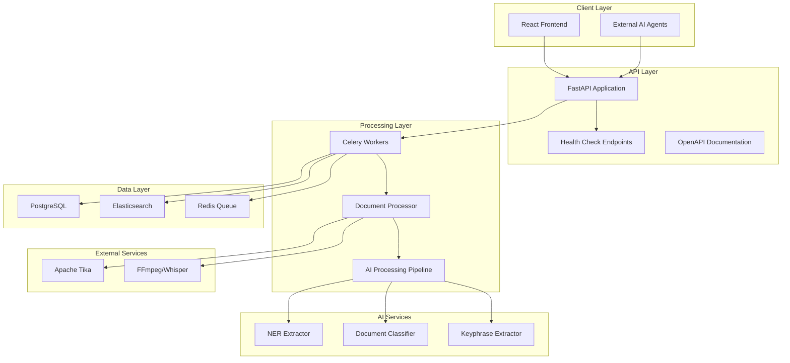
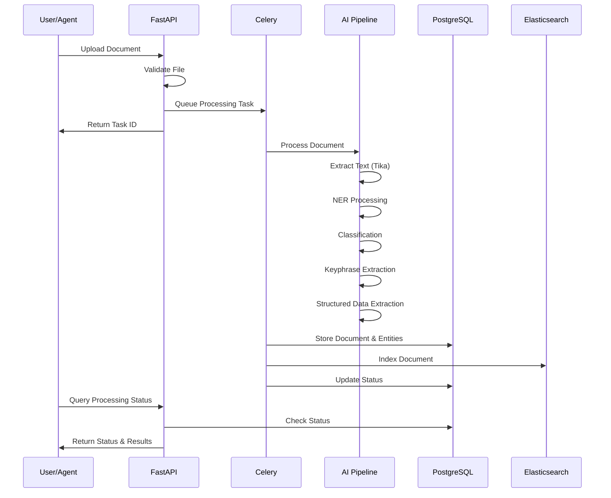

# Design Document

## Overview

The Industrial Knowledge Extraction System optimization focuses on fixing critical gaps in the current implementation, improving system reliability, and ensuring robust end-to-end processing. The design addresses missing functionality, improves error handling, and establishes proper service initialization and health monitoring.

## Architecture

### Current State Analysis

**Strengths:**
- Well-structured modular architecture with clear separation of concerns
- Comprehensive data models for industrial entities
- AI processing pipeline with NER, classification, and keyphrase extraction
- Multi-modal processing support (documents, images, videos)
- Elasticsearch integration for search capabilities

**Critical Issues Identified:**
1. **Service Initialization**: Docker containers use "sleep infinity" instead of proper application startup
2. **Missing Health Checks**: No verification of service dependencies on startup
3. **Incomplete Error Handling**: Limited error recovery and logging mechanisms
4. **Testing Gaps**: Minimal test coverage for core functionality
5. **Configuration Management**: Hardcoded values instead of environment-based configuration
6. **API Documentation**: Missing OpenAPI/Swagger documentation

### Target Architecture

## Components and Interfaces

### 1. Application Startup and Health Management

**FastAPI Application Initialization:**
- Replace "sleep infinity" with proper uvicorn server startup
- Implement startup event handlers for database initialization
- Add health check endpoints for service monitoring
- Configure proper logging and error handling

**Health Check System:**
- `/health` endpoint for basic application status
- `/health/detailed` endpoint for dependency status checks
- Service dependency verification (PostgreSQL, Elasticsearch, Redis, Tika)
- Graceful degradation when non-critical services are unavailable

### 2. Enhanced Error Handling and Logging

**Centralized Error Handling:**
- Custom exception classes for different error types
- Consistent error response format across all endpoints
- Proper HTTP status code mapping
- Error context preservation for debugging

**Comprehensive Logging:**
- Structured logging with JSON format for production
- Log levels: DEBUG, INFO, WARNING, ERROR, CRITICAL
- Request/response logging for API endpoints
- Processing pipeline logging with correlation IDs

### 3. Configuration Management

**Environment-Based Configuration:**
- Database connection strings from environment variables
- Service URLs and ports configurable
- AI model configuration parameters
- Feature flags for optional functionality

**Configuration Validation:**
- Startup validation of required environment variables
- Configuration schema validation
- Default value handling for optional settings

### 4. Enhanced AI Processing Pipeline

**Robust AI Integration:**
- Error handling for model loading failures
- Fallback mechanisms when AI services are unavailable
- Confidence score validation and thresholding
- Batch processing optimization for multiple documents

**Processing Quality Assurance:**
- Input validation for text processing
- Output validation for extracted entities
- Confidence score normalization across different models
- Processing metrics collection

### 5. Database Operations Enhancement

**Transaction Management:**
- Proper transaction boundaries for complex operations
- Rollback mechanisms for failed processing
- Connection pooling optimization
- Database migration support

**Query Optimization:**
- Efficient pagination for large result sets
- Proper indexing for frequently queried fields
- Relationship loading optimization
- Bulk operations for batch processing

### 6. Elasticsearch Integration Improvements

**Index Management:**
- Dynamic index creation with proper mappings
- Index lifecycle management
- Search result ranking optimization
- Faceted search capabilities

**Search Enhancement:**
- Multi-field search capabilities
- Fuzzy matching for industrial terminology
- Aggregation queries for analytics
- Search result highlighting

## Data Models

### Enhanced Document Processing Flow

### Database Schema Enhancements

**New Tables:**
- `processing_logs`: Track processing steps and errors
- `system_health`: Store health check results and metrics
- `configuration`: Store dynamic configuration values

**Enhanced Existing Tables:**
- Add `processing_duration` to documents table
- Add `retry_count` and `last_error` for failed processing
- Add `confidence_threshold` settings per entity type

## Error Handling

### Error Classification

1. **System Errors**: Database connectivity, service unavailability
2. **Processing Errors**: File corruption, unsupported formats
3. **AI Errors**: Model loading failures, processing timeouts
4. **Validation Errors**: Invalid input data, schema violations

### Error Recovery Strategies

**Retry Mechanisms:**
- Exponential backoff for transient failures
- Maximum retry limits to prevent infinite loops
- Dead letter queues for permanently failed tasks
- Manual retry capabilities for operators

**Graceful Degradation:**
- Continue processing with available AI services
- Store partial results when some processing fails
- Provide fallback responses when services are unavailable
- Queue operations for later processing when services recover

## Testing Strategy

### Unit Testing
- AI processing module tests with mock data
- Database operation tests with test database
- API endpoint tests with test client
- Utility function tests with edge cases

### Integration Testing
- End-to-end document processing workflows
- Database transaction integrity tests
- Elasticsearch indexing and search tests
- Service dependency integration tests

### Performance Testing
- Document processing throughput benchmarks
- Database query performance tests
- Elasticsearch search performance tests
- Memory usage monitoring during processing

### Test Data Management
- Sample industrial documents for testing
- Mock AI model responses for consistent testing
- Database fixtures for integration tests
- Performance baseline measurements

## Deployment and Operations

### Container Optimization
- Multi-stage Docker builds for smaller images
- Proper application startup commands
- Health check definitions in Docker Compose
- Resource limits and monitoring

### Monitoring and Observability
- Application metrics collection
- Processing pipeline monitoring
- Error rate and latency tracking
- Resource utilization monitoring

### Maintenance Procedures
- Database backup and restore procedures
- Elasticsearch index maintenance
- Log rotation and archival
- System health monitoring dashboards