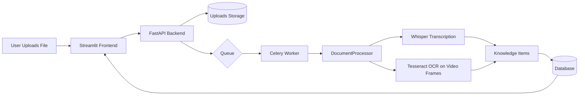

# EXPLAINIUM

A production-ready platform that turns documents, images, videos, and audio into actionable knowledge. Designed for non-technical users and robust enough for engineering teams.

— Clear impact: faster reporting, better process documentation, and quicker compliance reviews.

## Quick Start (First Time Setup)

### For Absolute Beginners
```bash
# 1. Open Terminal 

# 2. Clone the repository
git clone https://github.com/imaddde867/explainium-2.0.git
cd explainium-2.0

# 3. Run automated setup 
chmod +x setup.sh && ./setup.sh

# 4. Start the application
./start.sh
```

### Launch Application
```bash
./start.sh
```

Success: Your system is now running at:
- Main Interface: http://localhost:8501
- API Backend: http://localhost:8000
- API Docs: http://localhost:8000/docs

### First Steps
1. **Open** http://localhost:8501 in your browser
2. **Upload** any file (PDF, image, video, audio)
3. **Click** the processing button
4. **Watch** AI extract knowledge automatically!
5. **Explore** the results in the interactive table

---

## Key Features

### Multi-Modal AI Processing
- Documents: PDF, TXT, DOCX with deep text analysis
- Images: JPG, PNG, GIF with OCR and visual analysis
- Videos: MP4, AVI, MOV with audio transcription + frame OCR fallback
- Audio: MP3, WAV, FLAC with speech-to-text transcription

### Core Capabilities
- Computer Vision: OCR and image analysis
- Speech Processing: Whisper AI for audio transcription

### Knowledge Types Extracted
- Concepts: Key ideas and terminology
- Processes: Workflows and procedures
- Systems: Technical components and tools
- Requirements: Rules and compliance needs
- People: Roles and responsibilities
- Risks: Potential issues and hazards

### Apple Silicon Optimization
- Optimized for Apple Silicon; CPU-only paths are supported.

## How it works (at a glance)


## System Requirements

### Hardware (Recommended)
- System: Apple M4 Mac (or compatible)
- RAM: 16GB+ (32GB recommended)
- Storage: 10GB+ free space
- Network: Internet (for initial setup)

### Software
- OS: macOS 14.0+ (Apple Silicon optimized)
- Python: 3.9+ (automatically installed)
- Metal: Apple GPU acceleration (automatic)

## Installation & Setup

### Method 1: Automated Setup (Recommended)
```bash
# Clone repository
git clone https://github.com/imaddde867/explainium-2.0.git
cd explainium-2.0

# One-command setup (handles everything)
chmod +x setup.sh && ./setup.sh

# Start application
./start.sh
```

### Method 2: Manual Setup
```bash
# 1. Clone and navigate
git clone https://github.com/imaddde867/explainium-2.0.git
cd explainium-2.0

# 2. Create virtual environment
python3 -m venv venv
source venv/bin/activate

# 3. Install dependencies
pip install -r requirements.txt

# 4. Create directories
mkdir -p uploaded_files logs models

# 5. Start services
./start.sh
```

### Quick Commands
```bash
./start.sh    # Start both frontend and backend
./stop.sh     # Stop all services
./setup.sh    # Run full setup (first time only)
```

## Usage Guide

### Start the System
```bash
./start.sh
```
- Frontend: http://localhost:8501
- Backend: http://localhost:8000

### Upload Files
- Documents: PDF, TXT, DOCX
- Images: JPG, PNG, GIF, BMP, TIFF  
- Videos: MP4, AVI, MOV, MKV
- Audio: MP3, WAV, FLAC

### Extract Knowledge
1. Click "Choose a file" in the sidebar
2. Select your file (any supported format)
3. Click the processing button (🔍/🎬/🎤/🚀)
4. Watch AI extract knowledge in real-time!

### Analyze Results
- Table: View extracted knowledge items
- Charts: See distribution and analytics
- Filter: By type, confidence, search terms
- Export: Download results as CSV

### Stop the System
```bash
./stop.sh
```

## 📚 Usage Examples

### **Basic Document Processing**
```python
from src.processors.processor import DocumentProcessor

# Initialize processor
processor = DocumentProcessor()

# Process a document
document = {
    "content": "Customer onboarding process documentation...",
    "type": "pdf",
    "metadata": {"department": "operations"}
}

# Extract deep knowledge
knowledge = await processor.process_document(document)
```

### **Video Processing Pipeline**
The system processes videos by extracting audio with ffmpeg for Whisper transcription and sampling frames for OCR; results are combined.

### **Tacit Knowledge Extraction**
```python
# Extract patterns across multiple documents
documents = [doc1, doc2, doc3, ...]
tacit_knowledge = await processor.extract_tacit_knowledge(documents)

# Results include:
# - Implicit workflows
# - Organizational structures  
# - Policy changes over time
# - Communication networks
```

## Core Technologies
- Python 3.9+, FastAPI, Streamlit
- Celery + Redis (task queue)
- SQLAlchemy + Alembic (database)
- Whisper (openai-whisper) for speech-to-text
- ffmpeg (CLI) for audio extraction from video
- PyMuPDF, PyPDF2 for PDF; pytesseract + OpenCV for OCR

## Frontend Features

### Knowledge Table Dashboard
- Large Data Table: Display all extracted knowledge with search and filtering
- Advanced Filters: By type, confidence, date range, and search terms
- Visual Analytics: Charts showing knowledge distribution and trends
- Interactive Graph: Network visualization of knowledge relationships
- Export Options: CSV, JSON, Markdown, Cytoscape formats

### Real-time Updates
- Live updates as new knowledge is extracted
- Confidence scoring and validation
- Performance metrics and monitoring
- Memory usage tracking

## Model Management

### Automatic Setup
```bash
# Detect hardware and setup optimal models
python scripts/model_manager.py --action setup

# List installed models
python scripts/model_manager.py --action list

# Validate model integrity
python scripts/model_manager.py --action validate

# Clean up models
python scripts/model_manager.py --action cleanup
```

### Manual Model Management
```bash
# (Optional) Explicit setup (single unified profile)
python scripts/model_manager.py --action setup --hardware-profile m4_16gb

# Clean specific model type
python scripts/model_manager.py --action cleanup --model-type llm
```

## Troubleshooting

### **Common Issues & Solutions**

#### "Command not found" errors
```bash
# Make scripts executable
chmod +x setup.sh start.sh stop.sh
```

#### Python/pip issues
```bash
# Ensure Python 3.9+ is installed
python3 --version

# Reinstall dependencies
rm -rf venv
./setup.sh
```

#### AI models not loading
```bash
# Clear model cache and restart
rm -rf models/
./stop.sh && ./start.sh
```

#### Port already in use
```bash
# Kill existing processes
./stop.sh
# Or manually kill processes
pkill -f streamlit
pkill -f uvicorn
```

#### Low memory issues
- Close other applications
- Restart your Mac
- Ensure 16GB+ RAM available

#### Can't access web interface
- Check if services are running: `ps aux | grep streamlit`
- Try different browser or incognito mode
- Restart services: `./stop.sh && ./start.sh`

### System Status Check
```bash
# Check if services are running
ps aux | grep -E "(streamlit|uvicorn)"

# Check ports
lsof -i :8501  # Frontend
lsof -i :8000  # Backend

# Check logs
tail -f logs/*.log
```

## Performance Metrics

### Memory Usage
- **Model Loading**: <4GB for primary LLM
- **Processing**: <8GB peak during extraction
- **Cache**: <2GB for disk-based caching
- **Total**: <16GB for 16GB Mac, <32GB for 32GB Mac

### Processing Speed
- **Document Processing**: 100-500 words/second
- **Knowledge Extraction**: 2-5 seconds per document
- **Graph Building**: Real-time updates
- **Search Queries**: <100ms response time

### Scalability
- **Document Size**: Up to 100MB per document
- **Batch Processing**: Configurable batch sizes
- **Concurrent Processing**: Async processing support
- **Memory Optimization**: Automatic model swapping

## Deployment

### Local Development
```bash
# Development mode with hot reload
streamlit run src/frontend/knowledge_table.py --server.runOnSave true

# Run with debug logging
LOG_LEVEL=DEBUG python -m src.processors.processor
```

### Production Deployment
```bash
export ENVIRONMENT=production
streamlit run src/frontend/knowledge_table.py --server.port 8501
```

### Docker Support
```dockerfile
# Dockerfile example
FROM python:3.9-slim
WORKDIR /app
COPY requirements.txt .
RUN pip install -r requirements.txt
COPY . .
EXPOSE 8501
CMD ["streamlit", "run", "src/frontend/knowledge_table.py"]
```

## Troubleshooting (Advanced)

### **Common Issues**

#### Memory Errors
```bash
# Check available RAM
python -c "import psutil; print(psutil.virtual_memory())"

# Reduce batch size in config
batch_size: 2  # Instead of 4
```

#### Model Loading Failures
```bash
# Validate models
python scripts/model_manager.py --action validate

# Re-download corrupted models
python scripts/model_manager.py --action cleanup --model-type llm
python scripts/model_manager.py --action setup
```

#### Performance Issues
```bash
# Check Metal acceleration
python -c "import torch; print(torch.backends.mps.is_available())"

# Monitor performance
python -m src.core.optimization --monitor
```

### Logging and Debugging
```python
# Enable debug logging
import logging
logging.basicConfig(level=logging.DEBUG)

# Check system resources
from src.core.optimization import PerformanceMonitor
monitor = PerformanceMonitor()
print(monitor.get_system_status())
```

