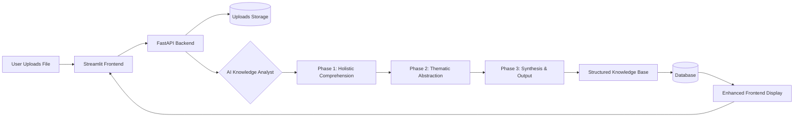

# 🧠 EXPLAINIUM - Enterprise Knowledge Extraction System v2.0

A production-ready platform that transforms any unstructured document into a structured, actionable, and synthesized knowledge base. Powered by a sophisticated 3-phase AI framework with **real-time progress tracking** and a modern, professional interface.

## ✨ New Features in v2.0

### 📊 Real-Time Progress Tracking
- **Live Progress Bar**: See processing completion percentage (10%, 20%, etc.)
- **Detailed Status Updates**: Know exactly what the system is doing at each step
- **Professional UI**: Clean, modern interface with enhanced user experience
- **Background Processing**: Upload files and track progress asynchronously

### 🧠 AI Knowledge Analyst Framework
- **Phase 1:** Holistic Comprehension - Understands document purpose, audience, and structure
- **Phase 2:** Thematic Abstraction - Categorizes information into actionable buckets  
- **Phase 3:** Synthesis & Structured Output - Creates coherent, markdown-formatted knowledge reports

### 🎯 Production-Ready Features
- **Health Monitoring**: Comprehensive system health checks
- **Scalable Architecture**: Celery-based task queue for handling multiple files
- **Professional UI/UX**: Modern design with progress indicators and analytics
- **Export Capabilities**: CSV and JSON export options
- **Enhanced Security**: Production-ready configuration and security measures

**Impact:** Faster reporting, better process documentation, quicker compliance reviews, and actionable insights from any document type with real-time feedback.

## Quick Start (First Time Setup)

### For Absolute Beginners
```bash
# 1. Open Terminal 

# 2. Clone the repository
git clone https://github.com/imaddde867/explainium-2.0.git
cd explainium-2.0

# 3. Run automated setup 
chmod +x setup.sh && ./setup.sh

# 4. Validate installation (NEW)
python scripts/validate_installation.py

# 5. Start the application
./start.sh
```

### Production Deployment
```bash
# For production deployment
./scripts/production_deploy.sh

# Monitor system health
python scripts/health_check.py --monitor
```

### Launch Application
```bash
./start.sh
```

Success: Your system is now running at:
- Main Interface: http://localhost:8501
- API Backend: http://localhost:8000
- API Docs: http://localhost:8000/docs

### First Steps with v2.0
1. **Open** http://localhost:8501 in your browser
2. **Upload** any file (PDF, image, video, audio) using the new professional interface
3. **Select** "Use Backend Processing" for progress tracking (recommended)
4. **Click** the processing button and **watch** the real-time progress bar!
5. **Monitor** detailed progress updates (10%, 20%, 40%, 60%, 80%, 95%, 100%)
6. **View** comprehensive processing results and analytics
7. **Explore** the structured knowledge base with enhanced visualizations

---

## Key Features

### 📊 Real-Time Progress Tracking (NEW in v2.0)
- **Live Progress Updates**: Visual progress bar showing completion percentage
- **Detailed Status Messages**: Step-by-step processing information
- **Background Processing**: Upload files and continue working while processing occurs
- **Task Management**: Track multiple processing tasks simultaneously
- **Professional UI**: Modern, clean interface with enhanced user experience
- **Processing Analytics**: View detailed statistics and results after completion

### Multi-Modal AI Processing
- Documents: PDF, TXT, DOCX with deep text analysis
- Images: JPG, PNG, GIF with OCR and visual analysis
- Videos: MP4, AVI, MOV with audio transcription + frame OCR fallback
- Audio: MP3, WAV, FLAC with speech-to-text transcription

### Core Capabilities
- Computer Vision: OCR and image analysis
- Speech Processing: Whisper AI for audio transcription

### AI Knowledge Analyst Categories
**Structured Thematic Analysis:**
- **Processes & Workflows:** Step-by-step instructions and procedures with actionable insights
- **Policies, Rules & Requirements:** Mandatory guidelines and compliance standards with priority levels
- **Key Data & Metrics:** Quantifiable data points (numbers, dates, measurements) with context
- **Roles & Responsibilities:** Clear assignment of duties and accountability
- **Definitions:** Explanations of key terms and concepts as defined in documents
- **Risks & Corrective Actions:** Potential issues with prescribed solutions and mitigation strategies

**Enhanced Output Features:**
- Priority-based categorization (Critical/Important/Informational)
- Synthesized summaries that combine related information
- Actionable insights and key takeaways
- Structured Markdown reports for easy consumption
- Visual analytics and relationship mapping

### Apple Silicon Optimization
- Optimized for Apple Silicon; CPU-only paths are supported.

## AI Knowledge Analyst Framework

### 3-Phase Analysis Process

**Phase 1: Holistic Comprehension**
- Analyzes entire document to understand primary purpose
- Identifies intended audience and document type (manual, contract, report, policy, etc.)
- Evaluates document structure, complexity level, and domain

**Phase 2: Thematic Abstraction**
- Categorizes information into 6 key buckets:
  - Processes & Workflows
  - Policies, Rules & Requirements  
  - Key Data & Metrics
  - Roles & Responsibilities
  - Definitions
  - Risks & Corrective Actions
- Assigns priority levels (Critical/Important/Informational)
- Identifies relationships between categories

**Phase 3: Synthesis & Structured Output**
- Synthesizes related information from different document sections
- Generates actionable insights and key takeaways
- Creates structured Markdown reports with clear formatting
- Focuses on actionable information over isolated text snippets

## How it works (at a glance)


## System Requirements

### Hardware (Recommended)
- System: Apple M4 Mac (or compatible)
- RAM: 16GB+ (32GB recommended)
- Storage: 10GB+ free space
- Network: Internet (for initial setup)

### Software
- OS: macOS 14.0+ (Apple Silicon optimized)
- Python: 3.9+ (automatically installed)
- Metal: Apple GPU acceleration (automatic)

## Installation & Setup

### Method 1: Automated Setup (Recommended)
```bash
# Clone repository
git clone https://github.com/imaddde867/explainium-2.0.git
cd explainium-2.0

# One-command setup (handles everything)
chmod +x setup.sh && ./setup.sh

# Start application
./start.sh
```

### Method 2: Manual Setup
```bash
# 1. Clone and navigate
git clone https://github.com/imaddde867/explainium-2.0.git
cd explainium-2.0

# 2. Create virtual environment
python3 -m venv venv
source venv/bin/activate

# 3. Install dependencies
pip install -r requirements.txt

# 4. Create directories
mkdir -p uploaded_files logs models

# 5. Start services
./start.sh
```

### Quick Commands
```bash
./start.sh    # Start both frontend and backend
./stop.sh     # Stop all services
./setup.sh    # Run full setup (first time only)
```

## Usage Guide

### Start the System
```bash
./start.sh
```
- Frontend: http://localhost:8501
- Backend: http://localhost:8000

### Upload Files
- Documents: PDF, TXT, DOCX
- Images: JPG, PNG, GIF, BMP, TIFF  
- Videos: MP4, AVI, MOV, MKV
- Audio: MP3, WAV, FLAC

### Extract Knowledge
1. Click "Choose a file" in the sidebar
2. Select your file (any supported format)
3. Click the processing button (🔍/🎬/🎤/🚀)
4. Watch AI extract knowledge in real-time!

### Analyze Results
- Table: View extracted knowledge items
- Charts: See distribution and analytics
- Filter: By type, confidence, search terms
- Export: Download results as CSV

### Stop the System
```bash
./stop.sh
```

## 📚 Usage Examples

### **AI Knowledge Analyst Processing**
```python
from src.ai.knowledge_analyst import AIKnowledgeAnalyst
from src.core.config import AIConfig

# Initialize AI Knowledge Analyst
config = AIConfig()
analyst = AIKnowledgeAnalyst(config)
await analyst.initialize()

# Analyze any document with 3-phase framework
content = "Customer onboarding process documentation..."
result = await analyst.analyze_document(content, {"source": "onboarding_doc"})

# Access structured results
print(f"Document Type: {result.document_context.document_type.value}")
print(f"Primary Purpose: {result.document_context.primary_purpose}")
print(f"Actionable Insights: {result.actionable_insights}")
print(f"Structured Report: {result.structured_markdown}")
```

### **Legacy Document Processing**
```python
from src.processors.processor import DocumentProcessor

# Initialize processor
processor = DocumentProcessor()

# Process a document (automatically uses AI Knowledge Analyst)
document = {
    "content": "Customer onboarding process documentation...",
    "type": "pdf", 
    "metadata": {"department": "operations"}
}

# Extract deep knowledge (now uses 3-phase framework)
knowledge = await processor.process_document(document)
```

### **Video Processing Pipeline**
The system processes videos by extracting audio with ffmpeg for Whisper transcription and sampling frames for OCR; results are combined.

### **Tacit Knowledge Extraction**
```python
# Extract patterns across multiple documents
documents = [doc1, doc2, doc3, ...]
tacit_knowledge = await processor.extract_tacit_knowledge(documents)

# Results include:
# - Implicit workflows
# - Organizational structures  
# - Policy changes over time
# - Communication networks
```

## Core Technologies
- Python 3.9+, FastAPI, Streamlit
- Celery + Redis (task queue)
- SQLAlchemy + Alembic (database)
- Whisper (openai-whisper) for speech-to-text
- ffmpeg (CLI) for audio extraction from video
- PyMuPDF, PyPDF2 for PDF; pytesseract + OpenCV for OCR

## Frontend Features

### Knowledge Table Dashboard
- Large Data Table: Display all extracted knowledge with search and filtering
- Advanced Filters: By type, confidence, date range, and search terms
- Visual Analytics: Charts showing knowledge distribution and trends
- Interactive Graph: Network visualization of knowledge relationships
- Export Options: CSV, JSON, Markdown, Cytoscape formats

### Real-time Updates
- Live updates as new knowledge is extracted
- Confidence scoring and validation
- Performance metrics and monitoring
- Memory usage tracking

## Model Management

### Automatic Setup
```bash
# Detect hardware and setup optimal models
python scripts/model_manager.py --action setup

# List installed models
python scripts/model_manager.py --action list

# Validate model integrity
python scripts/model_manager.py --action validate

# Clean up models
python scripts/model_manager.py --action cleanup
```

### Manual Model Management
```bash
# (Optional) Explicit setup (single unified profile)
python scripts/model_manager.py --action setup --hardware-profile m4_16gb

# Clean specific model type
python scripts/model_manager.py --action cleanup --model-type llm
```

## Troubleshooting

### **Common Issues & Solutions**

#### "Command not found" errors
```bash
# Make scripts executable
chmod +x setup.sh start.sh stop.sh
```

#### Python/pip issues
```bash
# Ensure Python 3.9+ is installed
python3 --version

# Reinstall dependencies
rm -rf venv
./setup.sh
```

#### AI models not loading
```bash
# Clear model cache and restart
rm -rf models/
./stop.sh && ./start.sh
```

#### Port already in use
```bash
# Kill existing processes
./stop.sh
# Or manually kill processes
pkill -f streamlit
pkill -f uvicorn
```

#### Low memory issues
- Close other applications
- Restart your Mac
- Ensure 16GB+ RAM available

#### Can't access web interface
- Check if services are running: `ps aux | grep streamlit`
- Try different browser or incognito mode
- Restart services: `./stop.sh && ./start.sh`

### System Status Check
```bash
# Check if services are running
ps aux | grep -E "(streamlit|uvicorn)"

# Check ports
lsof -i :8501  # Frontend
lsof -i :8000  # Backend

# Check logs
tail -f logs/*.log
```

## Performance Metrics

### Memory Usage
- **Model Loading**: <4GB for primary LLM
- **Processing**: <8GB peak during extraction
- **Cache**: <2GB for disk-based caching
- **Total**: <16GB for 16GB Mac, <32GB for 32GB Mac

### Processing Speed
- **Document Processing**: 100-500 words/second
- **Knowledge Extraction**: 2-5 seconds per document
- **Graph Building**: Real-time updates
- **Search Queries**: <100ms response time

### Scalability
- **Document Size**: Up to 100MB per document
- **Batch Processing**: Configurable batch sizes
- **Concurrent Processing**: Async processing support
- **Memory Optimization**: Automatic model swapping

## Deployment

### Local Development
```bash
# Development mode with hot reload
streamlit run src/frontend/knowledge_table.py --server.runOnSave true

# Run with debug logging
LOG_LEVEL=DEBUG python -m src.processors.processor
```

### Production Deployment
```bash
export ENVIRONMENT=production
streamlit run src/frontend/knowledge_table.py --server.port 8501
```

### Docker Support
```dockerfile
# Dockerfile example
FROM python:3.9-slim
WORKDIR /app
COPY requirements.txt .
RUN pip install -r requirements.txt
COPY . .
EXPOSE 8501
CMD ["streamlit", "run", "src/frontend/knowledge_table.py"]
```

## Troubleshooting (Advanced)

### **Common Issues**

#### Memory Errors
```bash
# Check available RAM
python -c "import psutil; print(psutil.virtual_memory())"

# Reduce batch size in config
batch_size: 2  # Instead of 4
```

#### Model Loading Failures
```bash
# Validate models
python scripts/model_manager.py --action validate

# Re-download corrupted models
python scripts/model_manager.py --action cleanup --model-type llm
python scripts/model_manager.py --action setup
```

#### Performance Issues
```bash
# Check Metal acceleration
python -c "import torch; print(torch.backends.mps.is_available())"

# Monitor performance
python -m src.core.optimization --monitor
```

### Logging and Debugging
```python
# Enable debug logging
import logging
logging.basicConfig(level=logging.DEBUG)

# Check system resources
from src.core.optimization import PerformanceMonitor
monitor = PerformanceMonitor()
print(monitor.get_system_status())
```

