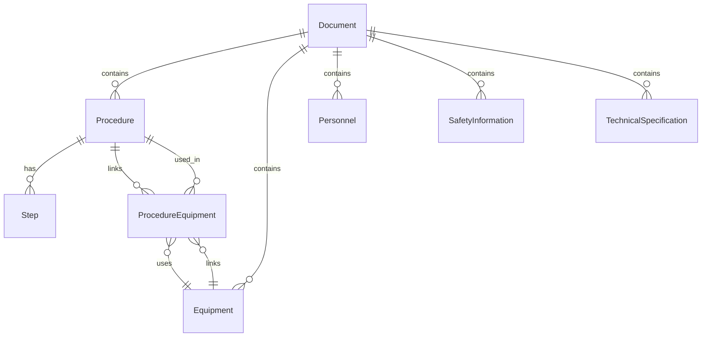

# Database Schema

This document provides a professional overview of the PostgreSQL database schema for the Industrial Knowledge Extraction System. It highlights the normalization process, relationship modeling, and best practices implemented to ensure a robust, scalable, and maintainable data architecture.

---

## **Schema Progress Summary**
- Normalized procedure steps: replaced the old JSON steps field in `Procedure` with a dedicated `Step` table.
- Added a `Step` table: each step is a separate row linked to its parent procedure.
- Added a `ProcedureEquipment` table: represents the many-to-many relationship between procedures and equipment.
- Updated relationships in `Procedure` and `Equipment` models to use the new association table.
- All major entities (Processes, Sub-processes/Steps, Equipment, Personnel, Safety_Info, Technical_Specs) are now normalized tables.
- Documentation and code are kept in sync for clarity and onboarding.

---

## **Entity-Relationship Diagram**

---

## Models and Tables

### `Document` Table

Stores metadata and extracted high-level information for each processed document.

| Column Name           | Type      | Description                                     | Constraints      |
|-----------------------|-----------|-------------------------------------------------|------------------|
| `id`                  | `Integer` | Primary key, unique identifier                  | `PRIMARY KEY`, `INDEX` |
| `filename`            | `String`  | Original filename                               | `INDEX`          |
| `file_type`           | `String`  | Type of file (e.g., `document`, `image`, `video`) |                  |
| `extracted_text`      | `Text`    | Full text extracted from the document           |                  |
| `metadata_json`       | `JSON`    | Raw metadata from Tika or other processors      |                  |
| `classification_category` | `String`  | Predicted document category                     |                  |
| `classification_score`| `Float`   | Confidence score of the classification          |                  |
| `status`              | `String`  | Processing status (e.g., `processed`, `failed`) |                  |
| `processing_timestamp`| `DateTime`| Timestamp of when the document was processed    | `DEFAULT CURRENT_TIMESTAMP` |
| `document_sections`   | `JSON`    | Extracted sections of the document (key-value pairs) |                  |

**Relationships:**
- One-to-many with `ExtractedEntity` (via `document_id`)
- One-to-many with `KeyPhrase` (via `document_id`)
- One-to-many with `Equipment` (via `document_id`)
- One-to-many with `Procedure` (via `document_id`)
- One-to-many with `SafetyInformation` (via `document_id`)
- One-to-many with `TechnicalSpecification` (via `document_id`)
- One-to-many with `Personnel` (via `document_id`)

### `ExtractedEntity` Table

Stores Named Entities extracted from the document text.

| Column Name           | Type      | Description                                     | Constraints      |
|-----------------------|-----------|-------------------------------------------------|------------------|
| `id`                  | `Integer` | Primary key, unique identifier                  | `PRIMARY KEY`, `INDEX` |
| `document_id`         | `Integer` | Foreign key to `Document` table                 | `FOREIGN KEY (documents.id)` |
| `text`                | `String`  | The extracted entity text                       |                  |
| `entity_type`         | `String`  | Type of entity (e.g., `PER`, `ORG`, `LOC`, `EQUIPMENT`) |                  |
| `score`               | `Float`   | Confidence score of the entity extraction       |                  |
| `start_char`          | `Integer` | Starting character index in `extracted_text`    |                  |
| `end_char`            | `Integer` | Ending character index in `extracted_text`      |                  |

**Relationships:**
- Many-to-one with `Document`

### `KeyPhrase` Table

Stores key phrases extracted from the document text.

| Column Name           | Type      | Description                                     | Constraints      |
|-----------------------|-----------|-------------------------------------------------|------------------|
| `id`                  | `Integer` | Primary key, unique identifier                  | `PRIMARY KEY`, `INDEX` |
| `document_id`         | `Integer` | Foreign key to `Document` table                 | `FOREIGN KEY (documents.id)` |
| `phrase`              | `String`  | The extracted key phrase                        |                  |

**Relationships:**
- Many-to-one with `Document`

### `Equipment` Table

Stores structured data about equipment mentioned in documents.

| Column Name           | Type      | Description                                     | Constraints      |
|-----------------------|-----------|-------------------------------------------------|------------------|
| `id`                  | `Integer` | Primary key, unique identifier                  | `PRIMARY KEY`, `INDEX` |
| `document_id`         | `Integer` | Foreign key to `Document` table                 | `FOREIGN KEY (documents.id)` |
| `name`                | `String`  | Name of the equipment                           | `INDEX`          |
| `type`                | `String`  | Type of equipment (e.g., `Pump`, `

### `EquipmentPersonnel` Table

Represents the many-to-many relationship between equipment and personnel. Each row links one piece of equipment to one person responsible for or associated with that equipment.

| Column Name     | Type      | Description                                 | Constraints      |
|-----------------|-----------|---------------------------------------------|------------------|
| `id`            | `Integer` | Primary key, unique identifier              | `PRIMARY KEY`, `INDEX` |
| `equipment_id`  | `Integer` | Foreign key to `Equipment` table            | `FOREIGN KEY (equipment.id)` |
| `personnel_id`  | `Integer` | Foreign key to `Personnel` table            | `FOREIGN KEY (personnel.id)` |

**Relationships:**
- Many-to-one with `Equipment`
- Many-to-one with `Personnel`

### `ProcedurePersonnel` Table

Represents the many-to-many relationship between procedures and personnel. Each row links one procedure to one person involved in that procedure.

| Column Name     | Type      | Description                                 | Constraints      |
|-----------------|-----------|---------------------------------------------|------------------|
| `id`            | `Integer` | Primary key, unique identifier              | `PRIMARY KEY`, `INDEX` |
| `procedure_id`  | `Integer` | Foreign key to `Procedure` table            | `FOREIGN KEY (procedures.id)` |
| `personnel_id`  | `Integer` | Foreign key to `Personnel` table            | `FOREIGN KEY (personnel.id)` |

**Relationships:**
- Many-to-one with `Procedure`
- Many-to-one with `Personnel`